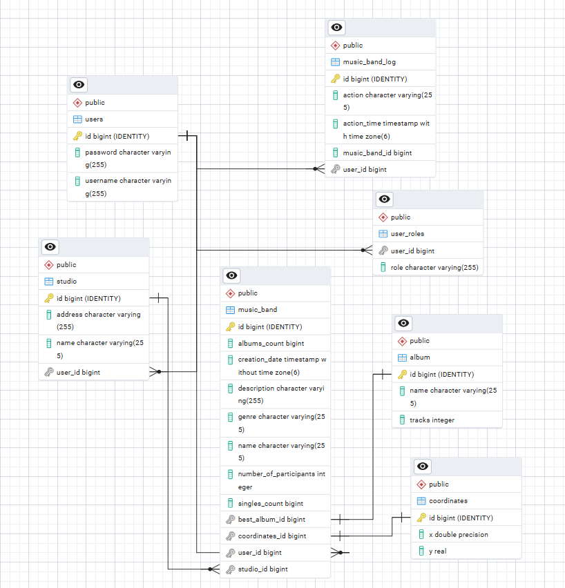

# Отчет и лаба курса 'Информационные системы'

---

- Студент: `Зыонг Динь Ань`
- Группа: `P3314`
- ИСУ: `343390`

Преподаватель: Пименов Данила Дмитриевич
---

# Описание:

## Лабораторная работа #1

Внимание! У разных вариантов разный текст задания!

Реализовать информационную систему, которая позволяет взаимодействовать с объектами класса Person, описание которого приведено ниже:

```java
public class MusicBand {
    private Integer id; //Поле не может быть null, Значение поля должно быть больше 0, Значение этого поля должно быть уникальным, Значение этого поля должно генерироваться автоматически
    private String name; //Поле не может быть null, Строка не может быть пустой
    private Coordinates coordinates; //Поле не может быть null
    private java.time.LocalDate creationDate; //Поле не может быть null, Значение этого поля должно генерироваться автоматически
    private MusicGenre genre; //Поле не может быть null
    private Integer numberOfParticipants; //Поле не может быть null, Значение поля должно быть больше 0
    private Integer singlesCount; //Поле не может быть null, Значение поля должно быть больше 0
    private String description; //Поле не может быть null
    private Album bestAlbum; //Поле не может быть null
    private Integer albumsCount; //Поле может быть null, Значение поля должно быть больше 0
    private Studio studio; //Поле может быть null
}
public class Coordinates {
    private double x; //Максимальное значение поля: 56
    private Float y; //Максимальное значение поля: 892, Поле не может быть null
}
public class Album {
    private String name; //Поле не может быть null, Строка не может быть пустой
    private long tracks; //Значение поля должно быть больше 0
}
public class Studio {
    private String name; //Поле может быть null
    private String address; //Поле может быть null
}
public enum MusicGenre {
    PROGRESSIVE_ROCK,
    PSYCHEDELIC_ROCK,
    HIP_HOP,
    SOUL,
    BRIT_POP;
}

```

Разработанная система должна удовлетворять следующим требованиям:

 - Основное назначение информационной системы - управление объектами, созданными на основе заданного в варианте класса.

 - Необходимо, чтобы с помощью системы можно было выполнить следующие операции с объектами: создание нового объекта, получение информации об объекте по ИД, обновление объекта (модификация его атрибутов), удаление объекта. Операции должны осуществляться в отдельных окнах (интерфейсах) приложения.При получении информации об объекте класса должна также выводиться информация о связанных с ним объектах.
 
 - При создании объекта класса необходимо дать пользователю возможность связать новый объект с объектами вспомогательных классов, которые могут быть связаны с созданным объектом и уже есть в системе.

 - Выполнение операций по управлению объектами должно осуществляться на серверной части (не на клиенте), изменения должны синхронизироваться с базой данных.

 - На главном экране системы должен выводиться список текущих объетов в виде таблицы (каждый атрибут объекта - отдельная колонка в таблице). При отображении таблицы должна использоваться пагинация (если все объекты не помещаются на одном экране).

 - Нужно обеспечить возможность фильтровать/сортировать строки таблицы, которые показывают объекты (по значениям любой из строковых колонок). Фильтрация элементов должна производиться только по полному совпадению.

 - Переход к обновлению (модификации) объекта должен быть возможен из таблицы с общим списком объектов и из области с визуализацией объекта (при ее реализации).

 - При добавлении/удалении/изменении объекта, он должен автоматически появиться/исчезнуть/измениться в интерфейсах у других пользователей, авторизованных в системе.
 
 - Если при удалении объекта с ним связан другой объект, связанные объекты должны быть связаны с другим объектом (по выбору пользователя), а изначальный объект удален.

 - Пользователю системы должен быть предоставлен интерфейс для авторизации/регистрации нового пользователя. У каждого пользователя должен быть один пароль. Требования к паролю: пароль должен быть уникален. В системе предполагается использование следующих видов пользователей (ролей):обычные пользователи и администраторы. Если в системе уже создан хотя бы один администратор, зарегистрировать нового администратора можно только при одобрении одним из существующих администраторов (у администратора должен быть реализован интерфейс со списком заявок и возможностью их одобрения).

 - Редактировать и удалять объекты могут только пользователи, которые их создали, и администраторы (администраторы могут удалять все объекты).

 - Зарегистрированные пользователи должны иметь возможность просмотра всех объектов, но модифицировать (обновлять) могут только принадлежащие им (объект принадлежит пользователю, если он его создал). Для модификации объекта должно открываться отдельное диалоговое окно. При вводе некорректных значений в поля объекта должны появляться информативные сообщения о соответствующих ошибках.

В системе должен быть реализован отдельный пользовательский интерфейс для выполнения специальных операций над объектами:

 - Вернуть один (любой) объект, значение поля description которого является минимальным.
 - Вернуть количество объектов, значение поля studio которых больше заданного.
 - Вернуть массив объектов, значение поля studio которых больше заданного.
 - Добавить новый сингл указанной группе.
 - Наградить группу как лучшую в указанном жанре, создав запись об этом в БД.

Представленные операции должны быть реализованы в рамках компонентов бизнес-логики приложения без прямого использования функций и процедур БД.

Особенности хранения объектов, которые должны быть реализованы в системе:

 - Организовать хранение данных об объектах в реляционной СУБД (PostgreSQL). Каждый объект, с которым работает ИС, должен быть сохранен в базе данных.

 - Все требования к полям класса (указанные в виде комментариев к описанию классов) должны быть выполнены на уровне ORM и БД.

 - Для генерации поля id использовать средства базы данных.

 - Пароли при хранении хэшировать алгоритмом MD5.

 - При хранении объектов сохранять информацию о пользователе, который создал этот объект, а также фиксировать даты и пользователей, которые обновляли и изменяли объекты. Для хранения информации о пользователях и об изменениях объектов нужно продумать и реализовать соответствующие таблицы.

 - Таблицы БД, не отображающие заданные классы объектов, должны содержать необходимые связи с другими таблицами и соответствовать 3НФ.

 - Для подключения к БД на кафедральном сервере использовать хост pg, имя базы данных - studs, имя пользователя/пароль совпадают с таковыми для подключения к серверу.

При создании системы нужно учитывать следующие особенности организации взаимодействия с пользователем:

 - Система должна реагировать на некорректный пользовательский ввод, ограничивая ввод недопустимых значений и информируя пользователей о причине ошибки.
 
 - Переходы между различными логически обособленными частями системы должны осуществляться с помощью меню.

 - При добавлении/удалении/изменении объекта, он должен автоматически появиться/исчезнуть/измениться на области у всех других клиентов.

При разработке ИС должны учитываться следующие требования:

 - В качестве основы для реализации ИС необходимо использовать Spring MVC.
 
 - Для создания уровня хранения необходимо использовать JPA + Hibernate.
 
 - Разные уровни приложения должны быть отделены друг от друга, разные логические части ИС должны находиться в отдельных компонентах.

 
 ### UML-диаграммы классов
 
 
